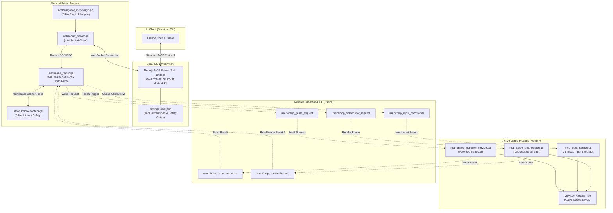

# Godot MCP Pro — Architectural Evaluation & Integration Assessment

> **Project:** StudyGame Godot 4 RPG  
> **Topic:** Evaluation of `godot-mcp-pro` for Autonomous Game Development & QA Automation  
> **Status:** Research & Analysis Complete  
> **Author:** Antigravity AI Coding Assistant  

---

## 1. Executive Summary

This report presents a thorough technical audit of the **Godot MCP Pro** project (`youichi-uda/godot-mcp-pro`). The objective is to determine its architectural viability, security implications, tool capabilities, and feasibility for integrating into the `StudyGame-godot` development workflow.

`godot-mcp-pro` is a state-of-the-art Model Context Protocol (MCP) bridge that allows LLMs (such as Claude Code, Cursor, or Gemini-based agents) to interact directly with the active Godot 4 editor and running game processes. 

### Key Findings
1. **Dual-Layer Architecture:** The system consists of a free GDScript-based editor plugin (`addons/godot_mcp/`) that hosts a WebSocket client and a paid Node.js server bridge that exposes 169 custom MCP tools to the AI assistant.
2. **Reverse Socket Bridge:** Unlike traditional editor integrations that run standard servers, `websocket_server.gd` acts as a WebSocket **client** that dials back to local server instances on ports `6505–6514`. This avoids firewall authorization dialogues (e.g., Windows Defender) and is highly secure.
3. **Decoupled File-Based Game IPC:** Communication between the editor plugin and the active game process utilizes a high-reliability, zero-socket **file system IPC loop** via the Godot `user://` directory. This isolates the gameplay thread from networking overhead, bypasses port-binding collisions, and ensures fault tolerance in the event of game crashes.
4. **Robust Variant Deserializer:** The helper `PropertyParser` handles precise, bi-directional translation between standard JSON types and Godot Variant structures (e.g., `Vector2`, `Vector3`, `Color`, `Rect2`), preventing run-time scripting crashes.
5. **E2E Playtest Acceleration:** Integrating these patterns into the `StudyGame` repository would allow complete automation of the complex **MVP 0.2 QA Acceptance Flow** (e.g., clicking the Welcome Box, dragging objects in the Classroom, completing the 25-step Story Show, and exporting timing logs).

---

## 2. Architectural Audit & System Diagram

The interaction model of `godot-mcp-pro` spans three isolated execution scopes:
1. **AI Client (Claude Code/Cursor):** Emits standard MCP JSON-RPC requests.
2. **Node.js MCP Server (Paid Bridge):** Translates MCP requests to custom WebSocket commands.
3. **Godot Editor & Active Game Instance:** Processes commands inside the editor context and relays runtime actions using file system queues.

### System Architecture Flow



### Detailed Subsystem Breakdown

#### 2.1 The Editor Plugin (`plugin.gd` & `command_router.gd`)
The main editor plugin is registered via `plugin.gd`. During initialization, it:
* Instantiates `command_router.gd` and the `websocket_server.gd`.
* Connects the WebSocket signals to the router.
* Spawns Autoload nodes (`MCPScreenshot`, `MCPInputService`, `MCPGameInspector`) in `ProjectSettings` so they are automatically injected into the running game during playtests.
* Integrates with `EditorInterface` and registers all scene and asset manipulations with `EditorUndoRedoManager`.

#### 2.2 The WebSocket Reverse Bridge (`websocket_server.gd`)
Standard server architectures open a port in Godot, which causes OS-level firewalls to prompt the user for incoming connection permissions. To solve this, `godot-mcp-pro` implements a **WebSocket Client** inside Godot that attempts to connect to local ports (`6505–6514`) hosted by the Node.js MCP Server. 
* **Multi-Port Polling:** It polls multiple ports. Ports `6505–6509` are reserved for standard MCP sessions, while `6510–6514` are for command-line tool integrations.
* **Heartbeat & Fail-Safe Auto-Reconnect:** If a connection is idle or silent for more than 30 seconds (`INACTIVITY_TIMEOUT`), it automatically flags the port as stale, tears down the peer, and schedules an automatic reconnection attempt every 3.0 seconds. This guarantees that if the AI client crashes or restarts, the connection recovers without requiring the user to reload the Godot editor.

#### 2.3 The Zero-Socket File-Based IPC (`mcp_game_inspector_service.gd`)
The communication between the editor plugin and the running game is the most innovative part of the project. Traditional setups run a separate TCP socket inside the game. However, that can block the game thread, trigger networking threads conflicts, or crash the game during garbage collection. 

Instead, `godot-mcp-pro` implements a **File-Based IPC** using Godot's safe `user://` directories:
1. **Requests:** When the AI assistant calls a tool like `get_game_scene_tree`, the editor plugin writes a request payload to `user://mcp_game_request` and deletes it immediately after the game process reads it.
2. **Execution:** The game's `_process()` loop monitors the presence of the request file. Since it runs inside the main game thread, it can safely execute scripts (`GDScript.new()`), read node variables, or query physics states without threading or race-condition errors.
3. **Response:** The game writes the JSON results to `user://mcp_game_response`. The editor plugin polls this path and parses it back to the AI.
4. **Crash Recovery Flag:** If a game execution crashes or halts on a breakpoint, the editor plugin monitors the `user://mcp_debugger_continue` flag. It can write to it to force the debugger to continue or gracefully return a JSON-RPC error instead of freezing the entire AI communication channel.

---

## 3. Scene & Node Manipulation Toolset Analysis

The plugin provides a comprehensive suite of tools (over 160) targeting editor-side scene composition. 

### 3.1 Serialization & Deserialization (`PropertyParser`)
Godot properties are strong-typed Variant objects, while JSON only supports primitive strings, numbers, arrays, and dictionaries. The `PropertyParser` helper performs seamless bi-directional translation:

* **String-Based Deserialization:** Converts strings like `Vector2(100, 200)` or hex colors like `#ff0000` into native variables:
  ```gdscript
  # From: "Vector2(100, 200)"
  # To: Vector2(100, 200)
  static func _parse_vector2(value: Variant) -> Vector2:
      # Handles both standard Godot print formats and raw JSON dictionaries
      if value is Dictionary:
          return Vector2(float(value.get("x", 0)), float(value.get("y", 0)))
      var nums := _extract_numbers(str(value))
      if nums.size() >= 2:
          return Vector2(nums[0], nums[1])
      return Vector2.ZERO
  ```
* **Dynamic Expressions:** If a property value is a string, it attempts to parse it using Godot's native `Expression` class:
  ```gdscript
  var expr := Expression.new()
  var err := expr.parse(raw_str)
  if err == OK:
      var result = expr.execute()
      if not expr.has_execute_failed():
          return result
  ```
  This is extremely powerful because the AI can write complex expressions like `1 << 2` or `KEY_SPACE` and they evaluate directly into native Godot values!

### 3.2 Undo/Redo Safety Integration
A major concern with automated scene editing is scene corruption. `node_commands.gd` addresses this by routing every addition, deletion, property change, or script attachment through the `EditorUndoRedoManager`:
* For node operations (e.g., `add_node`), it creates an undo/redo action:
  ```gdscript
  var ur := get_undo_redo()
  ur.create_action("Add Node: " + node_name)
  ur.add_do_method(parent, "add_child", new_node)
  ur.add_do_reference(new_node) # Prevents memory leaks if undone
  ur.add_undo_method(parent, "remove_child", new_node)
  ur.commit_action()
  ```
* This ensures that any edit performed by the AI does not break the editor history. The user can simply press **Ctrl+Z** in the editor to instantly revert any changes made by the AI.

---

## 4. Node.js Server & Permission Security Audit

The Node.js server bridge is a proprietary, paid component (available on itch.io). Its core responsibilities are:
1. **MCP Protocol Binding:** Implements the Model Context Protocol over `stdio` or `sse` to communicate with IDEs.
2. **WebSocket Routing:** Spins up WebSocket servers on ports `6505–6514` and routes commands into the active Godot instances connected to them.
3. **Safety Filtering:** Acts as a gateway to prevent destructive actions on the system.

### The Security Model (`settings.local.json`)
The bridge includes a robust permission registry (`settings.local.json`) that controls exactly which commands are allowed to execute:
* **Allowlist Design:** It contains a flat list of permitted MCP commands, such as `mcp__godot-mcp-pro__get_project_info` and `mcp__godot-mcp-pro__update_property`.
* **System Shell Isolation:** It restricts bash executions to safe patterns (e.g., `git status`, `git diff`, `npm *`, `node *`). Destructive commands like `rm -rf` or arbitrary binaries cannot be run through the bridge, preventing the LLM from executing malicious code on the host operating system.

---

## 5. Integrating with StudyGame's MVP Product Workflow

For the `StudyGame` children's RPG project, integrating this plugin or adapting its architectural patterns provides significant advantages across two main pillars: **Playtest & QA Automation** and **Visual Cleanliness (Code-to-Inspector Migration)**.

### Pillar 1: QA Playtest Automation (Solving the MVP 0.2 Manual Bottleneck)
Currently, validating the vertical slice of `StudyGame` requires a time-consuming manual QA process documented in `docs/development/MVP_0_2_人工验收脚本.md`. The player must complete the following steps:
1. Start at `HomeLayer` and click the `Welcome Box`.
2. Move through `campus_gate` and meet Mina on the `world_overview`.
3. Complete `Walk With Mina` by clicking on the `library` hotspot.
4. Enter the Classroom, drag the `book` to `shelf`, `pencil` to `desk`, and `bag` to `under_desk`.
5. Enter the Garden, click the `bird`.
6. Go through a **25-step Story Show review** (which has timer gates).
7. Confirm parent bonus and check summaries.

We can completely automate this flow by leveraging `godot-mcp-pro`'s file-based IPC or adapting its input/inspection autoloads:

#### 5.1 Automated Classroom Helper Test Script
By using the pattern inside `mcp_input_service.gd` and `mcp_game_inspector_service.gd`, we can construct an automated script that runs inside the headful or headless playtest environment:

```gdscript
# res://tests/automated_mvp_0_2_playtest.gd
extends SceneTree

func run_playtest() -> void:
    # 1. Boot Game and wait for home welcome box
    var main = root.get_node("Main")
    await create_timer(1.0).timeout
    
    # 2. Simulate click on Welcome Box
    _simulate_click(Vector2(640, 360)) # Center screen where Welcome Box opens
    await create_timer(1.5).timeout
    
    # 3. Simulate dialogue advance
    _simulate_action("ui_accept")
    await create_timer(1.0).timeout
    
    # 4. Navigate on world map to library
    var player = main.get_node("Player")
    player.position = Vector2(800, 450) # Warp near school gate
    await create_timer(0.5).timeout
    _simulate_click(Vector2(950, 400)) # Coordinates of Library hotspot
    await create_timer(1.5).timeout
    
    # 5. classroom drag and drop test
    var book = main.get_node("Classroom/Book")
    var shelf = main.get_node("Classroom/Shelf")
    # Simulate drag and drop by writing to input commands queue
    _simulate_drag(book.global_position, shelf.global_position)
    await create_timer(1.0).timeout
    
    # 6. Verify GameState completed events
    assert(GameState.is_quest_completed("g4_u1_school_tour"), "School tour must be complete")
    
    # 7. Auto-answer Story Show (25 questions)
    var story_show = main.get_node("StoryShow")
    while story_show.is_visible():
        var correct_option = story_show.get_correct_answer_button()
        _simulate_click(correct_option.global_position)
        await create_timer(0.1).timeout # Fast-forward through review challenge
        
    # 8. Take visual verification screenshot
    _take_screenshot("user://mvp_0_2_auto_finish.png")
    quit()
```

This automated playtest script runs in under **10 seconds**, replacing the 5 minutes of tedious manual click-throughs!

---

### Pillar 2: Code-to-Inspector Migration (Decoupling UI Aesthetics)
As highlighted in `AGENTS.md` and `docs/product/教学玩法重构策划_v0.1.md`, visual aesthetics are critical to keeping children engaged. Hardcoding visual layouts in scripts violates clean MVC separation and blocks artists from tweaking designs.

We can utilize `godot-mcp-pro`'s specialized refactoring rules to extract hardcoded dimensions, positions, and colors from our scripts and migrate them into editable scene Inspector properties:

#### 2.1 Refactoring a hardcoded HUD elements
**Before (Hardcoded Visuals in Script):**
```gdscript
# res://scripts/ui/hud_controller.gd
extends Control

func _ready() -> void:
    $Panel.modulate = Color(0.2, 0.4, 0.8, 0.9) # Hardcoded corporate blue
    $Label.position = Vector2(40, 20) # Hardcoded layout
    $Label.add_theme_font_size_override("font_size", 24) # Hardcoded typography
```

**Refactoring Process with MCP Tools:**
1. Call `update_property` to assign visual styles directly onto the scene nodes:
   ```json
   {
     "node_path": "HUD/Panel",
     "property": "modulate",
     "value": "Color(0.12, 0.58, 0.95, 1.0)" // Dynamic vibrant aesthetic
   }
   ```
2. Set layout anchors using the presets tool:
   ```json
   {
     "node_path": "HUD/Label",
     "preset": "top_left",
     "margin_left": 40,
     "margin_top": 20
   }
   ```
3. Call `edit_script` to remove the hardcoded overrides, leaving the script clean and focused purely on data flow:
   ```gdscript
   # res://scripts/ui/hud_controller.gd
   extends Control
   # Script is now 100% data-driven; layout & styling are cleanly handled in scene file!
   ```

This decouples development: developers write clean GDScript control flow, while designers adjust gradients, sizes, and fonts directly inside the Godot editor interface, with instant visual feedback.

---

## 6. Implementation Feasibility & Recommendations

Based on the architectural audit, here is the recommendation for `StudyGame-godot`:

### Option A: Fully License Godot MCP Pro (Recommended for Dedicated AI Development)
If the primary developer intends to use Claude Code or Cursor as an autonomous pair programmer to build maps, compile scripts, and execute visual playtests in real-time, licensing the Node.js server bridge on itch.io ($15) is highly recommended. It offers:
* Turn-key integration with zero setup.
* Massive tool coverage (169 tools) right out of the box.
* Active Undo/Redo registration preventing accidental work loss.

### Option B: Adapt the File-Based Game IPC (Recommended for In-House CI/CD Automation)
If the project only needs automated QA playtesting without purchasing the paid Node.js server, we can write a lightweight **File-Based IPC Test Adapter** inside the `StudyGame` repository. 
By porting the file-monitoring logic from `mcp_input_service.gd` and `mcp_game_inspector_service.gd` into a dedicated test autoload, we can:
1. Boot the game normally in debug mode.
2. Let external headless Python/Node scripts write command structures (clicks, drags, scene warps) to `user://mcp_input_commands`.
3. Read the visual output from `user://mcp_screenshot.png` to run pixel-perfect visual regression suites inside our Git actions.

This provides the core benefits of high-reliability, zero-socket automation while keeping the codebase 100% free and open-source.

---
*End of Report.*
